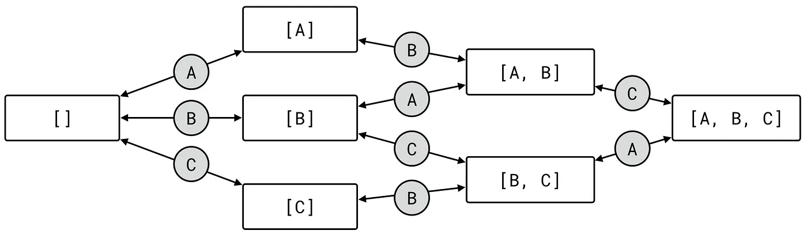

# my_mini_ecs

* Entity
  * unique “things” in your game
  * 唯一
  * represented as a unique integer value
  * 一般就是个uuid一类的东西
  * can have components
  * 可以有一堆的components
  * can be represented as a vector of component identifiers
  * 可以表现成一堆components的vect
  * The total set of components is the entity’s type (sometimes called an archetype)
  * 这一堆components组成了一个entity's 类型，也叫做archetype
  * a first person shooter could have a “Player” entity that has components “Position” and “Health”
  * 比如，一个Player entity，可以有俩components Position和Health
    * type of this entity就是[Position, Health], 也是archetype

* Archetype
  * An archetype is something that stores all the entities that have the same components.
  * 存储所有的entities，拥有者相同的components
  * Because of this, all entities stored in an archetype can share the same component id vector which reduces memory overhead by a lot.
  * 所有保存在archetype里的entites，可以分享相同的component id vector 可以减少内存的使用
  
* if you want to get things done fast, use arrays
  * The reason for this is that iterating over an array has a very predictable memory access pattern
  * 遍历数组，very predictable memory access pattern，内存很容易预测下一个操作
  * CPUs take advantage of this by prefetching data from RAM into the CPU cache that it thinks you will access next
  * cpu擅长在这时候把下一个预测操作的数据放入cache
  * 如果memory随机访问，cpu没法预测，比如oo模式,
  * This leads to loading junk data into the CPU cache, and in turn more RAM roundtrips. RAM access is much slower than the CPU cache, which can cause measurable slowdowns in application code.
  * 会导致cpu cache里都是垃圾，ram在做往返跑，就这么回事吧，意会一下，
  * Code that iterates arrays has another benefit, which is that under certain conditions compilers can insert special “vector” or SIMD instructions. SIMD (Single Instruction, Multiple Data) instructions are neat, because they run the same operation on multiple values, in the time it takes to do a single instruction! This can make code run anywhere from 2–16x faster than the same, non vectorized code.
  * 这里提到了SIMD指令，是在数组运算的时候，cpu可以使用这种vector or SIMD instructions，对same operation on multiple values这种情况，只使用一条指令就完成，从而提速2-16x
  * 为了得到这些优势both fast access and vectorization，需要our data to be stored in arrays and contiguous.存进数组，并保持连续

* contiguous连续的概念： Contiguous means that our data shouldn’t contain any gaps. We can have an array with 1000 elements, but if only 3 of those elements contain useful data, we’re no better off than where we started.

* SIMD指令
  * [](https://en.wikipedia.org/wiki/Single_instruction,_multiple_data)

* TODO: ABC problem, 这里之后，似懂非懂
  * 连续并不容易
  * 假如有3 entities,都有component A, 在一个array里保存
    * `A a[3];`
  * 使用array index for entity id， a[2]就是entity 2的component of A. 现在假设其中的两个entities也有component B，现在需要添加一个array of B
    * `B b[3];`
  * 同样使用entity id as the index，比如entity 2存在了A[2]和B[2]。但，由于array of 3， 但只有two entities with B, 无法保证数组contiguous, 不能vectorize our code, 因为有gap了
  * 替代，改用`B b[2];`可以contiguous, 可以vectorized
  * 但假设entities看起来这样
    `0: [A B]
    1: [A  ]
    2: [A B]`
  * 尽管连续，但B那边的index与entity的id不匹配， 意味着不能write vectorized code requires both A and B.
  * trick, 将所有的B排到A的前面
    `0: [A B]
    2: [A B]
    1: [A  ]`
  * 现在则需要mapping from entity ids to array indices, 毕竟已经不同了
  * 也可以处理某些entities只有B, TODO: 既然都要做index和entity的id匹配，那这样做还有意义么
    `3: [  B]
    0: [A B]
    2: [A B]
    1: [A  ]`
  * 如果再多一个component的时候，问题又来了
    `0: [  B  ]
    1: [  B C]
    2: [A B C]
    3: [A B  ]
    4: [A    ]
    5: [A   C]
    6: [    C]`
  * 没有办法get three perfectly contiguous arrays for A B C, 使用其他方法

* Archetypes, revisited
  * 不再为每一个component创建一个single array
  *  but instead create an array per component, per type?
  * 想象如下
  * 2 entities with [A], 2 entities with [A, B] and 2 entities with [A, C]
    `
    // Type [A]
    A a[2];
    // Type [A, B]
    A a[2];
    B b[2];
    // Type [A, C]
    A a[2];
    C c[2];
    `
  * entities现在长这样
    `0: [A]
    1: [A]

    2: [A B]
    3: [A B]

    4: [A C]
    5: [A C]`
  * 当我们想iterate A的时候，现在有3 separate arrays，a bit of overhead
  * 但前面的问题都没了, 所有的arrays are contiguous, and the array indices correspond with a single entity
  * 上面是个图其实

* Adding components
 * 如果添加了component，archetype变了。
  * TODO: 不懂, Find the archetype that has the component we want to add in addition to the components the entity already had
  * 给archetype插入一个row
  * TODO: 不懂, Move overlapping components over to the destination archetype
  * Remove the entity from the current archetype,从当前archetype删除entity, 因为archetype存储了多row的entity
  
  * 举例
    * 有个entity，带着archetype[position, velocity], 想加[health], 首先去查找/创建，archetype[position, velocity, health], 然后copy position and velocity components over to [Position, velocity, health]. 然后删除 the row from the [Position, Velocity] archetype
* 删除同上

* 找到archetype
  * 找到archetype的效率影响添加删除操作速度
  * 之前的方法不够快
    * Create a new vector with enough space to contain the component ids of the old archetype + the new component id
    * 创建一个新的vector，足够大，包含旧的component ids+新的component id
    * Populate the array with the old and new component ids, while making sure the vector is sorted
    * 用component ids填充新的array，保证vector排序
    * hash the vector
    * 使用hash，通过archetype_index找到archetype
    * Compare the list of the found archetype(s) with the vector to deal with possible hash collisions，在里面找到这个archetype，或者插入，还得解决hash collisions
  
* archetype graph
  * In a typical ECS application entities will move between the same archetypes many times. This means that we need many archetype searches that have the same parameters: if there is one entity that had Position, Velocity to which Health was added, there will likely be more.
  * TODO: 不明白 经典ecs，entities会有很多有相同的archetypes，嗯嗯，后面翻不太清楚，就是插入一个会有很多相同操作的意思吧
  * We can use this knowledge by caching the result of an archetype search. Before we can start thinking about how to cache a result, let’s first take a look at what the search function looks like:
  * cache 一个archetype 搜索0
  * `Archetype& add_to_archetype(Archetype& src, ComponentId id);`
  * 加入了一个结构，最后形成了一个map的结构
  ``` c++
    struct Archetype {
      ArchetypeId id;
      Type type;
      vector<Column> components;
      unordered_map<ComponentId, Archetype&> add_archetypes;
    };
  ```
  * 延迟初始化，每当新加入一个component，初始化下一个Archetype，如果不存在就得新增，不然就已经cache过了，可以直接指过去
  ``` c++
  void add_component(EntityId entity, ComponentId component) {
    // 通过entity获得当前archetype
    Record& record = entity_index[entity];
    Archetype& archetype = record.archetype;
    // 根据新增的component找到/新增指向的下一个archetype
    Archetype& next_archetype = archetype.add_archetypes[component];
    // 将当前的entity，移动到下一个archetype里，就是components里保存的row需要进行增删
    move_entity(archetype, record.row, next_archetype);
  }
  ```
  * 还得删除
  ```c++
  struct Archetype {
    ArchetypeId id;
    Type type;
    vector<Column> components;
    unordered_map<ComponentId, Archetype&> add_archetypes;
    unordered_map<ComponentId, Archetype&> remove_archetypes;
  };
  ```
  * 干脆放一块
  ``` c++
  struct ArchetypeEdge {
    Archetype& add;
    Archetype& remove;
  };
  struct Archetype {
    ArchetypeId id;
    Type type;
    vector<Column> components;
    unordered_map<ComponentId, ArchetypeEdge> edges;
  };
  ```
  * 最后形成一个图

* 目前的struct
``` c++
// A list of component ids
using Type = vector<ComponentId>;
// Component vector
using Column = vector<T>;
// Edges to other archetypes
struct ArchetypeEdge {
  Archetype& add;
  Archetype& remove;
};
// Type used to store each unique component list only once
struct Archetype {
  ArchetypeId id;
  Type type;
  vector<Column> components;
  unordered_map<ComponentId, ArchetypeEdge> edges;
};
// Find an archetype by its list of component ids
unordered_map<Type, Archetype> archetype_index;
// Find the archetype for an entity
unordered_map<EntityId, Archetype&> entity_index;
// Record in component index with component column for archetype
struct ArchetypeRecord {
  size_t column;
};
// Used to lookup components in archetypes
using ArchetypeMap = unordered_map<ArchetypeId, ArchetypeRecord>;
unordered_map<ComponentId, ArchetypeMap> component_index;
```
  
  
